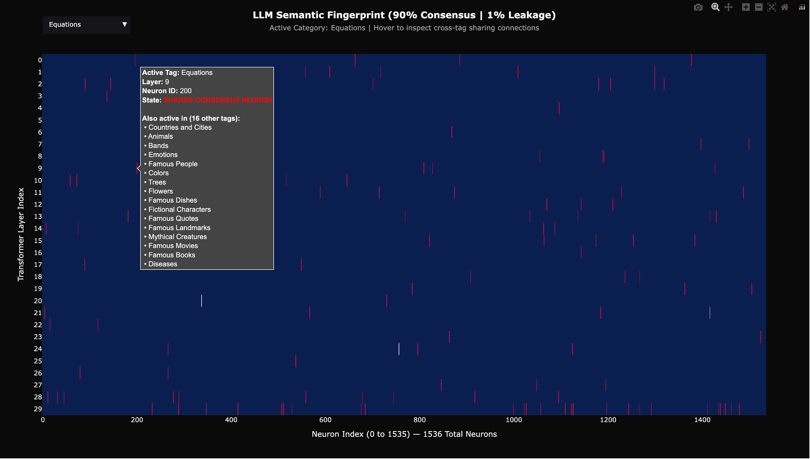
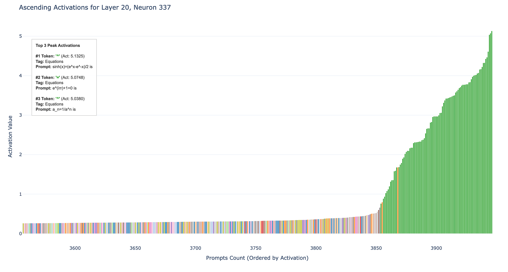

# Sigmund

Sigmund is an ongoing research project exploring Mechanistic Interpretability using lightweight models and specialized toy problems. The goal is to reverse-engineer how language models process specific concepts by mapping internal neural activations — specifically, identifying which neurons respond consistently and exclusively to a given semantic category.

You can find the full write-up, including methodology and findings, on [Medium](https://medium.com/@zmcostasimoes/7530a2503f4d).

## Pipeline overview

1. **`prompts.txt`** — ~4,000 prompts across 17 semantic categories (e.g. Animals, Equations, Diseases), each following the pattern "X is."
2. **`SmolLM2-135M-hooks.py`** — runs each prompt through SmolLM2-135M, extracting the peak activation per neuron across all tokens. Outputs a compressed `.npz` per prompt plus `neuron_peak_tokens.txt`, which logs which tokens triggered each neuron's maximum activation.
3. **`prompt_heatmap_visualizer.py`** — generates an interactive HTML heatmap of per-prompt neuron activations, using percentile-based min-max normalization to control for outlier-skewed activation distributions.
4. **`prompt_heatmap_Consensus.py`** — aggregates activations by concept and classifies each neuron as inactive, shared-consensus, or specialized, using two parameters:
   - **Consensus threshold**: the % of prompts within a concept that must trigger a neuron at peak activation for it to qualify as a candidate.
   - **Leakage threshold**: a ceiling on how often that neuron may also fire for *other* concepts before it's disqualified as concept-specific.
   
   Together these separate neurons that are genuinely concept-specific from ones that merely correlate with a concept by chance or shared surface features — a way of filtering signal from noise before drawing conclusions about what a neuron "represents."
5. **`Neuron_explorer.py`** — inspects a single neuron's activation across the full dataset, useful for auditing whether a "specialized" neuron holds up under scrutiny.

## Example output

*(embed 1–2 screenshots here — e.g. the Equations semantic footprint heatmap and the Layer 20/Neuron 337 activation plot from the Medium article)*

## Status

This is an early-stage, actively evolving project. Part I (documented here and in the Medium write-up) focuses on identifying monosemantic-leaning neurons via manually defined concept categories. Part II will explore whether evolutionary algorithms can automatically discover concept-isolating rules, rather than relying on human-predefined semantic tags.

## Requirements

- torch
- transformers
- numpy
- matplotlib
- plotly

## Output Examples

